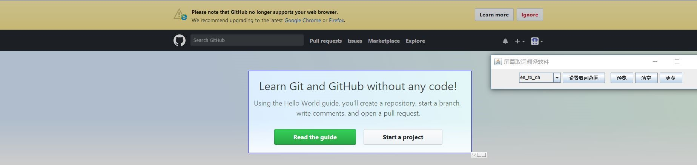
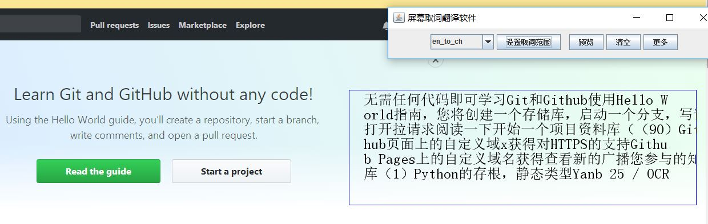
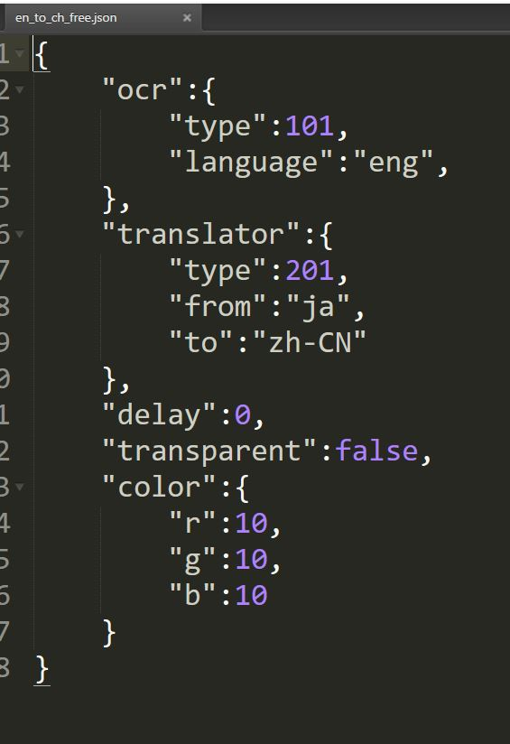
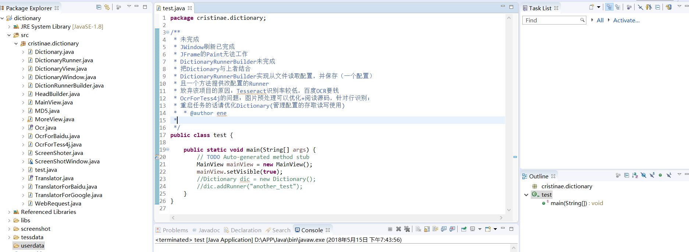

# a translator which based on screen

- 基于屏幕取词的翻译软件

## 注意！

- 本项目是半成品，因为tesseract的识别率较低，所以放弃该项目。

- 预览，清空和更多未完成。

- 内置百度OCR，tesseract，谷歌翻译，百度翻译的接口（两家百度收费，需要开发者账号）。

## 使用方法

- 截取取词范围

- 开始翻译

## 翻译的自定义设置

- 在userdata中可以设置自定义翻译官的类型，语言，OCR的种类，是否延时刷新，边框颜色和字幕条是否透明。

## 关于tesseract

- 目前在tessdata内只存放有中文简体，中文繁体，英语，日语的语言包，若需要更多请自行下载。

- 使用test创建

